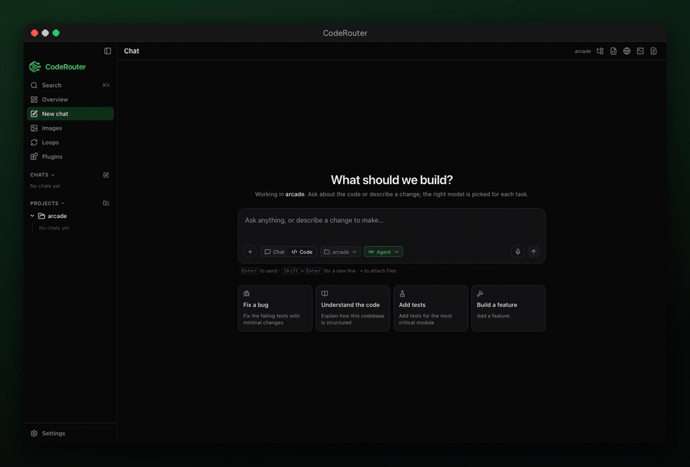
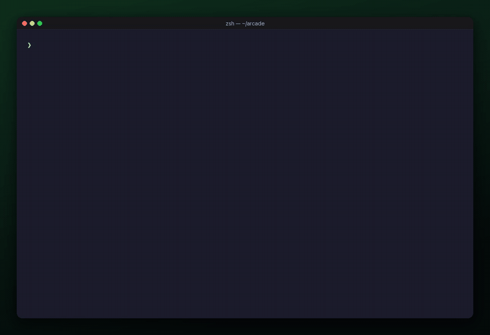

<p align="center">
  
</p>

<p align="center">
  <strong>An AI assistant and coding agent that picks the right model for every task.</strong>
</p>

<p align="center">
  CodeRouter sits between you and every AI model you have access to. Ask it a question and it answers;
  point it at a project and it plans the work, runs each change in a safe sandbox, checks it, and learns
  what works on your repo. Behind the scenes it routes each step to the model that fits it: fast, cheap
  models for routine work, frontier models for the hard parts. You stop choosing models. You just build.
</p>

<p align="center">
  
  <br />
  <sub>One prompt in the desktop app: planned, built in a sandbox, verified, and previewed. Real run, fast-forwarded.</sub>
</p>

<p align="center">
  <a href="https://github.com/Code-Router/CodeRouter/releases/latest"><strong>Download</strong></a> ·
  <a href="#quick-start">Quick start</a> ·
  <a href="https://github.com/Code-Router/CodeRouter/issues/new/choose">Report a bug</a>
</p>

---

## Why CodeRouter

- **One assistant, any model.** Works with your existing **Claude Code** or **Codex** CLI, or any API key: OpenAI, Anthropic, OpenRouter, DeepSeek, Groq, or a local Ollama model.
- **Chat or code.** Questions, emails, summaries and research get one well-routed answer. Coding tasks get a full pipeline: plan, execute in an isolated git worktree, validate, review.
- **Spend where it matters.** Most of a coding session isn't hard. Renames, boilerplate and "where is X?" go to fast, cheap models; deep reasoning, refactors and architecture get the frontier ones.
- **See every decision.** Each model pick is logged with its reason, and routing improves from the outcomes of your own runs.
- **A full desktop app.** Chats, plans, loops, sessions, cost tracking with a monthly budget, a built-in image studio, browser and terminal in one place.

## Download

### Desktop app

**[Download the latest release](https://github.com/Code-Router/CodeRouter/releases/latest)**

| Platform | File |
|----------|------|
| macOS (Apple Silicon) | `CodeRouter-<version>-arm64.dmg` |
| Windows | `CodeRouter Setup <version>.exe` |

The app is self-contained (no separate Node or CLI install needed) and updates itself: when a new version is out, a card appears bottom-left with **Update / Later**.

> Builds aren't code-signed yet. On macOS, right-click the app, choose **Open** and confirm. On Windows, if SmartScreen appears, click **More info**, then **Run anyway**.

### CLI

Requires **Node 24+**.

```bash
npm install -g coderouter-cli
coderouter          # or the short alias: cr
```

First launch walks you through adding an API key (or auto-detects a Claude Code / Codex CLI you already have). `coderouter app` launches the desktop app from the terminal.

### Inside Claude Code / Codex (MCP)

Run `coderouter init` to register CodeRouter as an MCP server for your host agent.

## Quick start

<p align="center">
  
  <br />
  <sub>A trivial edit routes to a cheap model, a redesign to a frontier one; <code>run --apply</code> lands the change.</sub>
</p>

```bash
coderouter                            # interactive REPL
coderouter run "rename getCwd"        # one-shot, non-interactive
coderouter route "fix typo"           # show the chosen route (no run)
coderouter logs                       # browse run journals and decision timelines
coderouter loop "make CI green"       # generate + run a self-correcting loop
```

In the REPL, type `/` for commands and `@` to reference files.

## Bugs and feature requests

[Open an issue](https://github.com/Code-Router/CodeRouter/issues/new/choose). Include your OS, the app or CLI version (Settings, then About, or `coderouter --version`), and steps to reproduce.

## License

CodeRouter is proprietary software, free to download and use. This repository hosts releases and issue tracking only; the source code is not public. See [LICENSE](LICENSE).
