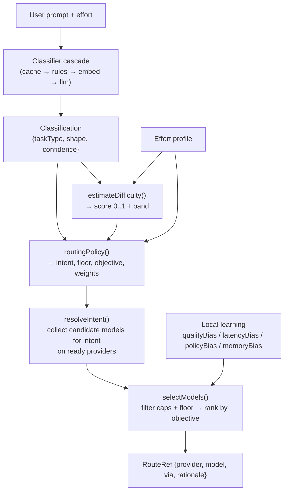

# CodeRouter Routing: A Per-Task, Cost-Aware Value Router

> Status: living design document / working paper. This describes how routing
> works **today** in the codebase and is the reference we edit and implement
> against. When you change routing behavior, update this doc in the same PR.

## 1. Motivation

An LLM coding agent that sends every request to the single most powerful
model is simultaneously wasteful and slow. But naively "always pick the
cheapest" produces bad code on the tasks that matter. The goal of the router
is to answer one question well, **per task**:

> Given *this* request, which available model gives the best result **per
> dollar per second**, subject to a quality floor the task actually needs?

Design north stars:

1. **Per-task, not global.** A typo fix and a distributed-systems refactor
   should not route the same way. Difficulty is *estimated per request*.
2. **Cost & speed are first-class.** They enter the objective directly, not
   as an afterthought. A marginally weaker but far cheaper/faster model can
   and should win when quality is close.
3. **Quality floors, not quality targets.** Each task earns a *minimum* tier;
   above the floor we optimize value. Only genuinely hard work (or an
   explicit effort bump) raises the floor to frontier.
4. **Decouple difficulty from model choice.** The policy layer names an
   *intent + floor + objective + weights*; it never names a concrete model.
   You can re-price or add models without touching routing logic.
5. **Learn locally, bounded.** Real run outcomes nudge priors, but bounded +
   shrinkage-weighted so noise can only re-rank near-ties.

This is intentionally close in spirit to "model-routing" systems like
Arch-Router / RouteLLM: a small, fast decision layer selects a downstream
model per query. Ours is deterministic, benchmark-grounded, and refined by
local feedback rather than a trained router model.

## 2. Where the code lives

| Concern | File |
| --- | --- |
| Classification (taskType + shape + confidence) | `packages/core/src/classify/*` |
| Difficulty estimation | `packages/core/src/router/difficulty.ts` |
| Effort profiles | `packages/core/src/router/effort.ts` |
| Instant short-circuits | `packages/core/src/router/instant.ts` |
| Per-task policy table | `packages/core/src/models/policies.ts` |
| Quality tiers, objectives, value weights | `packages/core/src/models/tiers.ts` |
| Value selector (scoring + ranking) | `packages/core/src/models/select.ts` |
| Model cards (benchmark priors) | `packages/core/src/models/cards.ts` |
| Intents ↔ catalog entries | `packages/core/src/catalog/*` |
| Intent → candidate resolution | `packages/core/src/catalog/resolve.ts` |
| Top-level decision cascade | `packages/core/src/router/policy.ts` |
| Local learning (quality/latency/policy bias) | `packages/core/src/models/learn.ts` |
| Repo memory bias | `packages/core/src/router/bias.ts` |
| Runtime wiring (RouterContext) | `packages/cli/src/runtime.ts` |

## 3. End-to-end flow



The top-level entry point is `pick(classification, ctx, opts)` in
`router/policy.ts`. It runs a short **decision cascade** (Section 9), and for
the common case delegates the hard choice to
`routingPolicy()` → `resolveIntent()` → `selectModels()`.

## 4. Inputs

### 4.1 Classification

```ts
type TaskType =
  | 'feature' | 'bugfix' | 'refactor' | 'test'
  | 'docs' | 'investigation' | 'review' | 'trivial';

type CognitiveShape = {
  deepReasoning: number;   // 0..1
  multiFileTaste: number;  // 0..1 — large/coordinated refactors
  hugeContext: number;     // 0..1 — needs a very large context window
  adversarial: number;     // 0..1 — security / correctness under attack
  algorithmic: number;     // 0..1 — non-trivial algorithms/complexity
  exploratory: number;     // 0..1 — open-ended investigation
};

type Classification = {
  taskType: TaskType;
  shape: CognitiveShape;
  confidence: number;      // 0..1
  rationale: string;
  source: 'rules' | 'embed' | 'llm' | 'cache' | 'instant';
  hash: string;
};
```

`taskType` answers "what kind of work", `shape` answers "what cognitive
demands", and `confidence` tells us how much to trust the label.

### 4.2 The classifier cascade

`ClassifierCascade.classify()` runs four stages and stops at the first
confident answer, caching the result keyed by `(prompt + repoHead +
manifestHash)`:

```
cache → rules → embed → llm → fallback
```

- **cache** — exact prior answer for this input; free.
- **rules** — regex/keyword heuristics; ~0ms; returns a confidence.
- **embed** — nearest-neighbour against a seed corpus of labeled examples.
- **llm** — a *cheap* judge model (Haiku / 4o-mini / DeepSeek-chat) only when
  rules+embed are below `rulesConfidenceFloor` (default 0.7). This is the
  only stage that can cost money, and it uses the cheapest capable model.
- **fallback** — a conservative default classification.

Because the cheap stages resolve most prompts, the expensive judge rarely
runs, and never twice for the same input.

### 4.3 Effort

`Effort ∈ {low, medium, high, max}` is the single user-facing "spend for
quality" knob. `effortProfile(effort)` (`router/effort.ts`) expands it into a
profile that shifts thresholds across the whole system:

| effort | reasoningEffort | tournamentSize | maxHandoffPasses | maxCostUsd | maxDurationMs |
| --- | --- | --- | --- | --- | --- |
| low | minimal | 1 | 0 | $0.25 | 60s |
| medium | medium | 1 | 0 | $1.50 | 90s |
| high | high | 3 | 1 | $5 | 180s |
| max | high | 4 | 2 | $20 | 300s |

Effort also feeds difficulty estimation and can raise the quality floor
directly (Section 7).

## 5. Difficulty estimation

`estimateDifficulty(classification, effort, prompt?)` collapses all signals
into a single `score ∈ [0,1]` and a coarse **band**. This generalizes
per-shape thresholds: a task can earn a frontier model from the *combination*
of signals even when no single shape crosses its own threshold.

**Core blend** (intrinsic task prior + strongest "hard" shape):

```
reasoningMax = max(deepReasoning, algorithmic, adversarial, multiFileTaste)
score = 0.5 * TASK_BASE[taskType] + 0.5 * reasoningMax
```

`TASK_BASE` priors:

| task | base | | task | base |
| --- | --- | --- | --- | --- |
| trivial | 0.05 | | investigation | 0.55 |
| docs | 0.12 | | feature | 0.52 |
| test | 0.38 | | bugfix | 0.48 |
| review | 0.45 | | refactor | 0.62 |

**Additive adjustments:**

- Low confidence (`confidence < 0.6`): `+ (0.6 - confidence) * 0.4` — ambiguous
  prompts lean slightly harder so they aren't under-served.
- Effort bump: `low −0.12`, `medium 0`, `high +0.28`, `max +0.45`.
- Optional cheap prompt features (only when the raw prompt is available):
  - length > 12k chars: `+0.12`; > 4k: `+0.06`
  - stack trace present: `+0.10`
  - code fence present: `+0.04`
  - hard keywords (`architecture|refactor|concurrency|deadlock|algorithm|…`): `+0.08`

`score` is clamped to `[0,1]`, then banded:

```
score < 0.25 → low      0.25–0.50 → medium
0.50–0.75 → high        ≥ 0.75    → frontier
```

The band is what the policy table uses to decide whether to escalate the
floor even at medium effort.

## 6. Quality tiers, model cards, and objectives

### 6.1 Coding score priors (`cards.ts`)

Every model has a curated `quality.coding ∈ [0,100]` prior, anchored to
public benchmarks (SWE-bench Verified, Aider polyglot, LMArena coding Elo).
Scores encode *relative* strength, not an absolute percentage:

```
~90+   current frontier coding models
65–79  strong daily drivers
45–64  mid
<45    small / weak
```

Unknown model ids resolve to a **conservative prior** (they don't get to
masquerade as frontier just because they're cheap). Cards also carry
`tools`, `reasoning`, `contextWindow`, `inputs` (modalities), and advisory
prices (live OpenRouter prices override at resolve time).

### 6.2 Tiers

```ts
TIER_MIN = { frontier: 80, strong: 65, mid: 45, small: 0 }
```

A **floor** is expressed as a tier; a candidate "clears the floor" if its
effective coding score ≥ `TIER_MIN[floor]`.

### 6.3 Objectives

```ts
type Objective = 'quality' | 'cost' | 'value';
```

- `quality` — rank by coding score; cost breaks ties. Used by tournaments /
  `pickStrong` when we deliberately want the top model.
- `cost` — cheapest model that still clears the floor. Used for genuinely
  trivial work.
- `value` — the default for real coding: a normalized weighted score across
  quality, cheapness, speed, and context. **This is what keeps everyday work
  off the priciest frontier model.**

## 7. Per-task policy table (`policies.ts`)

`routingPolicy(classification, effort, difficulty)` picks exactly **one**
policy per request. A policy is `{ name, intent, floor, objective, weights,
rationale }` — never a concrete model.

Priority order (first match wins):

0. **Difficulty escalation** — if `difficulty.band === 'frontier'` and effort
   is not already high/max and the task isn't huge-context/trivial/docs →
   `frontier` floor, top-quality weights, intent `multi-file` (if
   `multiFileTaste > 0.75`) else `deep-reasoning`.
1. **Explicit high/max effort** — frontier floor, top-quality weights
   (respecting a huge-context need first).
2. **Hard reasoning shape** (`deepReasoning|algorithmic|adversarial ≥ 0.7`) →
   `deep-reasoning`, frontier floor.
3. **Huge context** (`hugeContext > 0.7`) → `huge-context`, strong floor,
   context-led weights.
4. **Multi-file taste** (`> 0.75`) → `multi-file`, strong floor,
   refactor weights.
5. **Trivial / docs** → `fast-cheap` intent, `mid` floor, **`cost` objective**.
6. **Default** → `balanced-agent`, strong floor, `value` objective.

### 7.1 Weight presets

The `value` objective's feature weights (roughly sum to ~1):

| preset | quality | cheapness | speed | context | reasoning | used by |
| --- | --- | --- | --- | --- | --- | --- |
| balanced | 0.70 | 0.15 | 0.05 | 0.07 | 0.03 | default code edit / chat |
| refactor | 0.62 | 0.22 | 0.06 | 0.08 | 0.02 | multi-file refactors |
| reasoning | 0.65 | 0.10 | 0.03 | 0.05 | 0.17 | hard thinking |
| context | 0.30 | 0.12 | 0.05 | 0.50 | 0.03 | long inputs |
| topQuality | 0.80 | 0.06 | 0.02 | 0.07 | 0.05 | high/max effort, frontier |

**Tuning routing behavior is a single-file change in `policies.ts`.**

## 8. Intents → candidates → selection

### 8.1 Intents (`catalog/types.ts`)

```
deep-reasoning · multi-file · huge-context · balanced-agent · fast-cheap · local-offline
```

Each catalog entry (`catalog/entries.ts`) binds a concrete provider+model to
one or more intents with a `rank`. Per-intent defaults (`tiers.ts`):

| intent | floor | objective | minContextWindow |
| --- | --- | --- | --- |
| deep-reasoning | frontier | quality | 16k |
| multi-file | frontier | quality | 60k |
| balanced-agent | strong | quality | 16k |
| huge-context | strong | quality | 200k |
| fast-cheap | mid | cost | 8k |
| local-offline | small | cost | 0 |

Note: the policy table **overrides** the intent's default floor/objective/
weights when it resolves (e.g. `balanced-agent` runs with the `value`
objective and balanced weights for interactive routing).

### 8.2 Candidate collection (`resolve.ts`)

`resolveIntent(intent, registry, opts)`:

1. Collect catalog entries bound to this intent, on providers that are
   **ready** (configured + enabled) and not forbidden.
2. Expand **dynamic providers** (OpenRouter) with their *live* catalog, so we
   route to the best current model, not one hardcoded id. Curated entries
   remain as offline fallbacks.
3. Special cases:
   - `ollama`: provider-ready ≠ model-installed; skip uninstalled models.
   - `codex` on a ChatGPT (non-API-key) login: heavily demote coding score
     for strong-model intents, because the CLI ignores `-m` and may hand us a
     weaker model. Still kept as a last-resort candidate.
   - `requireEditable`: only providers whose adapter can write files
     (`claude_code`, `codex`, `coderouter_agent`) are eligible for execution
     sub-tasks.
4. Resolve each candidate to a `ModelCard` and hand the pool to the selector.

### 8.3 The value selector (`select.ts`)

`selectModels(candidates, constraints)`:

1. **Capability filter** — drop candidates missing required tools/vision or
   below `minContextWindow`.
2. **Effective coding score** — `base coding + bounded local delta`
   (Section 10), clamped to `[0,100]`.
3. **Floor** — keep candidates clearing `TIER_MIN[floor]`. If **none** clear
   it, fall back to the whole pool and flag `belowFloor` (so we always return
   *something*, marked as best-available).
4. **Rank** by objective.

**The value score** (normalized, roughly `[0,1]`):

```
value(c) = w.quality  * (q / 100)
         + w.cheapness * cheapness(c)
         + w.speed     * speedPrior(c)
         + w.context   * contextScore(c)
         + w.reasoning * (c.reasoning ? 1 : 0)
```

Feature normalizations:

- **cheapness** — with `cost = pricePer1MIn + pricePer1MOut` and a price
  anchor of `$8/1M`:

  ```
  cheapness = PRICE_ANCHOR / (PRICE_ANCHOR + cost)      // anchor = 8
  ```

  A model priced at the anchor scores 0.5; free → 1; pricier → 0. This is the
  knob that lets a cheap strong model out-value a pricey frontier one.

- **contextScore** — linear ramp from an 8k floor to a 256k ceiling:

  ```
  contextScore = clamp((cw - 8_000) / (256_000 - 8_000), 0, 1)   // 0 if cw ≤ 8k
  ```

- **speedPrior** — no measured latency at selection time, so a static prior
  (non-reasoning + cheaper ⇒ faster), refined by learned `latencyBias`:

  ```
  base = reasoning ? 0.35 : 0.85
  speedPrior = clamp(0.6 * base + 0.4 * cheapness + latencyAdj, 0, 1)
  ```

**Tie-breaking** per objective:

- `cost`: price asc → coding desc → context desc.
- `value`: value desc → coding desc → price asc → context desc.
- `quality`: coding desc → price asc → context desc.

## 9. The top-level decision cascade (`pick()`)

`pick()` short-circuits the common expensive path when a cheaper decision is
clearly correct. In order:

1. **Config route overrides** — hard `taskType → routeRef` pins, returned
   verbatim.
2. **Vision constraint** — if the prompt has images, bypass all non-vision
   shortcuts and only consider vision-capable models, trying intents from
   `balanced-agent` → … → `fast-cheap`. Returns a `no-vision-model` sentinel
   if none are available.
3. **Instant routes** (`instant.ts`) — regex matches for trivially cheap,
   well-defined prompts (typo fix, rename symbol, add comment, format,
   commit message, changelog). These synthesize a high-confidence
   classification and route to the cheapest capable model, skipping the whole
   classifier/context pipeline (< 20ms, no judge fee).
4. **Force-cheap** — used by the handoff fix-pass; cheapest capable route
   (honoring a user `cheap` pin first).
5. **Per-task policy** — the main path: `estimateDifficulty` → `routingPolicy`
   → resolve the policy's intent with its floor/objective/weights, folding in
   the effective quality bias. **User pins** beat the catalog here: a `cheap`
   pin for cost policies, a `strong` pin for any policy needing a strong/
   frontier model.
6. **Intent fallback chain** — if the policy's specialized pool is empty
   (e.g. no 200k-context model ready), fall back to `balanced-agent`, then to
   `fast-cheap`.
7. **Last resort** — the first ready provider's first model; if none, throw a
   "configure an API key" error.

`pickStrong(classification, ctx, effort)` is a separate entry point used by
tournaments / dualPlan: it returns a **diverse set** of strong contenders
(one per shape-triggered intent, plus balanced), de-duplicated, capped at
`tournamentSize`. It always uses a `frontier` floor and ignores cost.

## 10. Local learning & feedback loops

All learning is **bounded, shrinkage-weighted, and gated by a sample floor**,
so thin/noisy data can only re-rank near-ties — never turn a small model into
a frontier one. Built in `models/learn.ts`, wired into `RouterContext` by
`buildExecutionEnv` (`runtime.ts`) from the last ~500 runs in the SQLite
store.

Shared shape (per model, per signal):

```
shrink = n / (n + K)                          // K = 8
delta  = clamp(signal * shrink * maxDelta, -maxDelta, +maxDelta)
```

### 10.1 `qualityBias` — global coding-score delta

Blends run success and explicit user ratings into a coding-score delta:

```
successSignal = clamp((successRate - baseline) / (1 - baseline), -1, 1)   // baseline = 0.6
ratingSignal  = mean(rating ∈ [-1, 1])
signal        = ratingCount > 0 ? 0.5*successSignal + 0.5*ratingSignal : successSignal
```

Defaults: `minSamples = 3`, `K = 8`, `maxDelta = 12` coding points. Added to
the prior in `effectiveCoding()` at selection time.

### 10.2 `latencyBias` — speed-prior adjustment

From observed `durationMs / tokensOut` per model, normalized against the
population **median** ms/token. Faster-than-typical → positive nudge to the
`speed` feature. Bounded to `±0.25`, same sample floor + shrinkage.

### 10.3 `policyBias` — per-task-class preference (local RouteLLM)

`taskClass → (model → coding delta)`, reusing the quality-bias math per task
class. The sub-map for the *current* task type is folded into the value
selector's quality bias, so a model that reliably wins (say) refactors gets
nudged up **for refactors only**. Cost is deliberately *not* folded in here —
the value selector already weighs cheapness first-class.

### 10.4 `memoryBias` — repo-scoped route memory (`bias.ts`)

From per-`taskType` route stats in the store:

- **forbiddenRoutes** — `failRate ≥ 0.8` over `≥ 3` runs → hard-excluded.
- **preferredRoutes** — `successRate ≥ 0.7` → a **bounded** coding bonus
  (`+6`, capped at `+12`) toward that route. This is a *tie-breaker*, demoted
  from an old hard short-circuit that used to pin routing to a single model
  and reinforce itself.
- **lastSuccessfulRoute** — used by `--fast`.

### 10.5 User preferences & pins

`preferredModels.{strong,cheap}` (set in the dashboard Models tab) are honored
when their provider is ready and not forbidden: a `strong` pin wins policies
that demand a strong/frontier model; a `cheap` pin wins cost policies.

## 11. Escape hatches

- **`--fast`** (`fast.ts`) — skip classifier, context scan, and validators;
  reuse the repo's last-known route (or a sensible default). Still runs inside
  the sandbox so the diff is reviewable.
- **`--no-instant`** — bypass the instant short-circuits.
- **Config `routeOverrides`** — hard pins per task type.

## 12. Worked examples

Assume Anthropic (Opus coding≈93 @ $15/$75), a Sonnet-class strong model
(coding≈78 @ $3/$15), and a cheap model (coding≈50 @ $0.30/$0.90) are all
ready.

**A) "fix typo in README"** → instant match → `fast-cheap`/cost → cheap model.
No classifier judge fee, sub-20ms.

**B) "add a null check in `parseUser`" (feature, medium effort)** →
difficulty ≈ low/medium, no hard shape → policy `code-edit`
(`balanced-agent`, strong floor, value + balanced weights). Opus clears the
floor but its cheapness ≈ `8/(8+90)=0.08`; Sonnet's ≈ `8/(8+18)=0.31`. With
quality 0.70·0.93 vs 0.70·0.78 the quality gap is `~0.105`, but the cheapness
term (0.15·(0.31−0.08) ≈ `0.034`) plus speed narrows it — Sonnet typically
wins on value unless local learning has boosted Opus for this repo. **Everyday
work lands on strong-but-cheaper, not the frontier.**

**C) "redesign the scheduler to avoid the race condition" (refactor, high
effort)** → `adversarial`/`deepReasoning` high **and** effort high → policy
`top-quality` (frontier floor, topQuality weights). Quality dominates (0.80),
cheapness barely matters (0.06) → Opus-class frontier model.

**D) "summarize this 300k-token log" (huge context)** → `hugeContext > 0.7`
→ `huge-context` policy, context-led weights (0.50) → long-context model even
if its raw coding score is lower.

## 13. Invariants (do not break)

- The policy layer never names a concrete model — only intent/floor/objective/
  weights. Model choice stays in the catalog + selector.
- Unknown models resolve to a conservative prior; cheapness can never lift an
  unverified model above the floor on its own.
- Learning is always bounded + shrinkage-weighted + sample-gated.
- Below-floor selection is allowed only as a flagged fallback, never silently
  preferred.
- `requireEditable` execution sub-tasks only ever route to file-editing
  adapters.

## 14. How to change behavior (playbook)

- **Make everyday work cheaper/pricier:** adjust `WEIGHTS.balanced` (cheapness
  vs quality) in `policies.ts`, or the `PRICE_ANCHOR` in `select.ts`.
- **Escalate/relax when things get hard:** tune `TASK_BASE` / bump values /
  band thresholds in `difficulty.ts`.
- **Add or re-price a model:** edit `cards.ts` (and bind intents in
  `catalog/entries.ts`). No routing-logic change needed.
- **Add a new routing regime:** add an `Intent`, bind entries, and reference
  it from a policy branch.
- **Change the quality bar per tier:** `TIER_MIN` in `tiers.ts`.

## 15. Open questions / future work

- **Learned router model.** Today difficulty + policy are hand-tuned. Consider
  training a tiny classifier on local outcomes to predict the value-maximizing
  intent directly (closer to RouteLLM/Arch-Router), keeping the current system
  as the cold-start prior.
- **Online value calibration.** `cheapness`/`speed` normalizations
  (`PRICE_ANCHOR`, context ramp, speed base) are static constants; they could
  be periodically recalibrated from observed price/latency distributions.
- **Token-count-aware cost.** The cost feature uses per-1M list prices, not
  the request's expected token volume. A cheap model on a huge prompt may cost
  more than a pricier one on a tiny prompt.
- **Confidence-aware exploration.** When two candidates are within ε on value,
  occasionally explore the runner-up to gather learning signal (bandit-style),
  instead of always exploiting the top pick.
- **Per-shape floors.** Floors are currently per-task/effort; some shapes
  (e.g. `adversarial`) might warrant their own floor independent of taskType.
- **Cross-repo priors.** Memory bias is repo-scoped; a global (opt-in) prior
  could speed up cold starts on new repos.
